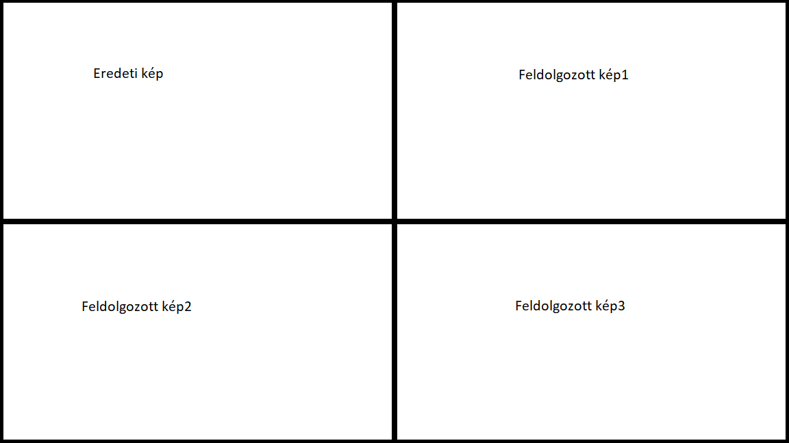

<h1>Funkcionális specifikáció</h1>

<h2>Igényelt üzleti folyamatok modellje.</h2>

Azért, hogy egyszerűbbé tegyük a feladatot ez egy olyan program, amely platformfüggetlen, felhasználóbarát valamint könnyen kezelhető. 
A kezelőfelület egyszerű és egyértelmű, bárki használati útmutató nélkül használatba tudja venni. 

<h2>Vágyálom rendszer leírása:</h2>

    A program képes lesz több élkereső alkalmazására  
    A program mentési funkcival is fog rendelkezni  
    Egyszerűen használható, és hatékony program  
    A felhasználói felületet letisztult, barátságos.  

<h2>A rendszerre vonatkozó szabályok leírása</h2>

    Az igények szerint a rendszer szabványos eszközökkel készül, C++ programozási nyelvben.  

<h2>Követelmény lista</h2>

| ID | Név | Kifejtés |
|---|---|---|
|1| Prewitt|A program képes a Prewitt élkereső elvégzésére.|
|2| Sobel|A program képes a Sobel élkereső elvégzésére.|
|3| Laprance|A program képes a Laprance élkereső elvégzésére.|
|4| Canny|A program képes a Canny élkereső elvégzésére.|

<h2>Forgatókönyvek</h2>
<ul>
<li> Kép bevitele </li>
<li> Kép zajszrése</li>
<li> Élkereső elvégzése</li>
<li> Az eremény mutatása</li> 
</ul>

<h2>Jelenlegi üzleti folyamatok modellje</h2>

A jelenlegi helyzetben az alkalmazás csak a Sobel,Canny és Laprance -élkeresőket használja, illetve ezeknek a műveleteknek az eredményét tudja megjeleníteni.\
A jövőbeli viszonyításokhoz elvégzéséhez több funkcióra lenne szükség.\
A képek mentése nem lehetséges.\
Jelenlegi viszonylatokhoz képest lassú.\
Nincs vezérlő eszköz.\

<h2>Használati esetek</h2>

Az alkalmazás felhasználói akkor használják azt, ha egy vagy több körölményt szeretnének figyelembe venni élkeresések kapcsán.\
A felhasználók a múveletek elvégzése mellett már meglévő eredményeket is ellenőrizhetik.\
Ha egy külső forrásból kapott eredmény gyanús, az alkalmazás lehetővé teszi ennek leelenőrzését.\
Az alkalmazást tehát fel lehet használni több módon is:\
1: Egy matematikai művelet kiszámitása, az eredmény késöbbi felhasználása céljából\
2: Egy művelet eredményének leelenőrzése, a hiba elkerülése végett

<h2>Képernyőterv<h2>

<h2>Fogalomszótár</h2>
   
Élkereső: Egy képen belüli színeltérések kimutatása alkalmas eljárás. 
   Receptorok: Külső hatásokat befogadó érzékelők. 
   Zajszűrés: A nem kívánt bemenetek csökkentése/eltávolítása.

